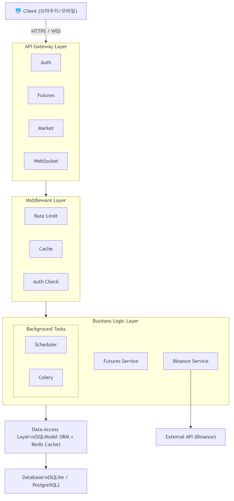
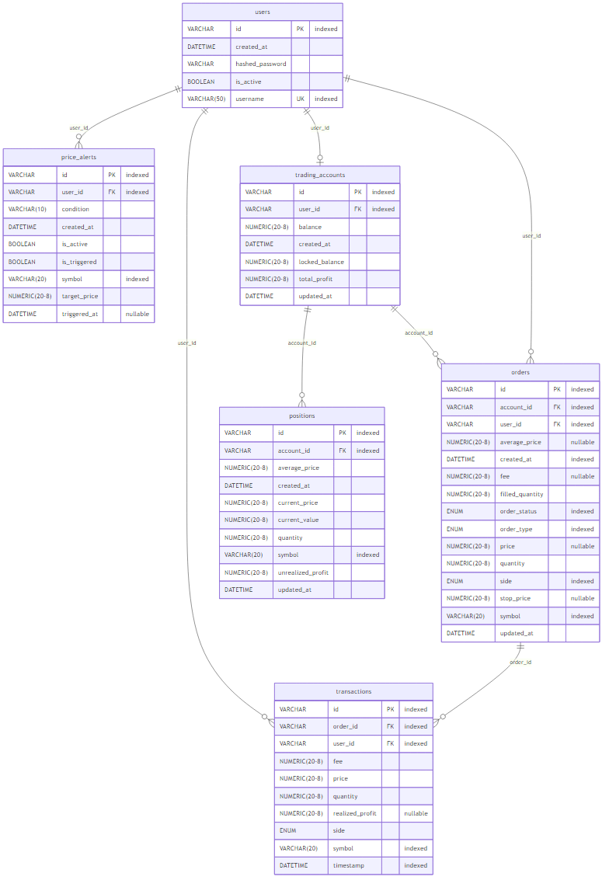

# 🪙 BeenCoin - 프로덕션 레벨 암호화폐 거래 플랫폼

<div align="center">


**개인 포트폴리오 프로젝트 
</div>

---

### 🎯 개발 목표

- ✅ **확장 가능한 아키텍처** 설계 및 구현
- ✅ **프로덕션 배포 경험** 및 운영 노하우 습득
- ✅ **자동화된 CI/CD 파이프라인** 구축
- ✅ **테스트 주도 개발(TDD)** 적용

## 🚀 주요 기능

### 1. 사용자 관리
- 🔐 JWT 기반 인증/인가
- 👤 회원가입/로그인
- 🔒 비밀번호 bcrypt 암호화

### 2. 실시간 시장 데이터
- 📊 BTC, ETH, BNB, ADA 등 주요 코인
- 📈 실시간 가격 차트
- 📉 24시간 변동률, 거래량
- 🔄 WebSocket 실시간 업데이트

### 3. 주문 시스템
- 💵 **시장가 주문**: 즉시 체결
- 🎯 **지정가 주문**: 목표가 도달 시 자동 체결
- 🔄 매수/매도 지원
- 💸 수수료 0.1% 적용

### 4. 선물 거래
- 📊 레버리지 거래 
- 🎯 자동 손절/익절
- 📈 포지션 관리
- 💰 미실현 손익 계산

### 5. 포트폴리오
- 💼 보유 자산 현황
- 📊 실시간 평가손익
- 📜 거래 내역 조회
- 📈 수익률 통계

---

## 🛠️ 기술 스택

## 🏗️ 시스템 아키텍처

### 계층형 아키텍처 다이어그램



*6개 레이어로 구성된 확장 가능한 마이크로서비스 아키텍처*

### 아키텍처 설명

| 레이어 | 구성 요소 | 설명 |
|--------|----------|------|
| **클라이언트** | Web, Mobile | 사용자 인터페이스 |
| **API Gateway** | FastAPI, WebSocket | 요청 라우팅, Rate Limiting |
| **서비스 레이어** | Auth, Futures, Market | 비즈니스 로직 |
| **데이터 레이어** | PostgreSQL, Redis | 데이터 영속성, 캐싱 |
| **외부 연동** | Binance API | 시장 데이터 수집 |
| **모니터링** | Prometheus, Grafana | 시스템 상태 추적 |

### 데이터 흐름

1. 사용자 요청 → API Gateway
2. 인증/권한 확인 → 서비스 레이어
3. 비즈니스 로직 처리 → 데이터 저장
4. 실시간 데이터 → WebSocket으로 클라이언트 전송
5. 주기적 작업 → 스케줄러가 백그라운드 실행

### 핵심 기술 스택

| 카테고리 | 기술 |
|----------|------|
| **웹 프레임워크** | FastAPI 
| **ORM** | SQLModel 
| **데이터베이스** | SQLite , PostgreSQL 
| **인증** | JWT (PyJWT) 
| **HTTP 클라이언트** | httpx 
| **WebSocket** | FastAPI WebSocket |
| **캐싱** | Redis 
| **테스트** | Pytest
| **ASGI 서버** | Uvicorn 0.24
| **컨테이너** | Docker
| **CI/CD** | GitHub Actions
| **코드 품질** | Black, Ruff, mypy

---

## 📁 프로젝트 구조

```
BeenCoin/
├── .github/
│   └── workflows/
│       ├── backend-ci-cd.yml          # 메인 CI/CD 파이프라인
│       ├── test.yml                    # 테스트 워크플로우
│       └── deploy.yml                  # 배포 워크플로우
│
├── app/                                # 백엔드 애플리케이션
│   ├── main.py                        # FastAPI 앱 진입점
│   ├── main_secure.py                 # 보안 강화 버전
│   │
│   │
│   ├── background_tasks/              # 백그라운드 작업
│   │   ├── celery_app.py             # Celery 설정
│   │   └── tasks.py                   # 비동기 작업
│   │
│   ├── cache/                         # 캐싱 레이어
│   │   ├── cache_manager.py          # 캐시 관리자
│   │   └── redis_cache.py            # Redis 캐시 구현
│   │
│   ├── core/                          # 핵심 설정
│   │   ├── config.py                 # 환경 설정
│   │   ├── config_secure.py          # 보안 설정
│   │   ├── database.py               # DB 연결
│   │   └── database_optimized.py     # DB 최적화
│   │
│   ├── middleware/                    # 미들웨어
│   │   ├── cache_middleware.py       # 캐시 미들웨어
│   │   └── rate_limit.py             # Rate Limiting
│   │
│   ├── models/                        # 데이터베이스 모델
│   │   ├── database.py               # 기본 모델 (User, Order, Account)
│   │   ├── futures.py                # 선물 거래 모델
│   │   └── futures_fills.py          # 체결 내역 모델
│   │
│   ├── routers/                       # API 라우터 (20+ 엔드포인트)
│   │   ├── alerts.py                 # 가격 알림 API
│   │   ├── auth.py                   # 인증 API
│   │   ├── auth_secure.py            # 보안 강화 인증
│   │   ├── futures.py                # 선물 거래 API
│   │   ├── futures_portfolio.py      # 선물 포트폴리오 API
│   │   ├── market.py                 # 마켓 데이터 API
│   │   └── websocket.py              # WebSocket 엔드포인트
│   │
│   ├── schemas/                       # Pydantic 스키마
│   │   ├── user.py                   # 사용자 스키마
│   │   └── user_secure.py            # 보안 사용자 스키마
│   │
│   ├── services/                      # 비즈니스 로직
│   │   ├── auto_stop_loss.py         # 자동 손절 서비스
│   │   ├── binance_service.py        # Binance API 통신 (33KB)
│   │   ├── binance_service_interface.py
│   │   ├── futures_service.py        # 선물 거래 서비스 (29KB)
│   │   └── portfolio_service.py      # 포트폴리오 서비스
│   │
│   ├── tasks/                         # 스케줄러
│   │   ├── futures_scheduler.py      # 선물 스케줄러
│   │   └── scheduler.py              # 메인 스케줄러 (15KB)
│   │
│   └── utils/                         # 유틸리티
│       ├── error_handlers.py         # 에러 핸들러
│       ├── exceptions.py             # 커스텀 예외
│       ├── logger.py                 # 로거 설정
│       ├── rate_limiter.py           # Rate Limiter
│       └── security.py               # 보안 유틸
│
├── tests/                             # 테스트 스위트 (87% 커버리지)
│   ├── conftest.py                   # Pytest 설정 + Fixtures
│   ├── test_helpers.py               # 테스트 헬퍼 함수
│   │
│   ├── integration/                  # 통합 테스트
│   │   └── test_all_api_endpoints.py # E2E API 테스트 (24KB)
│   │
│   ├── unit/                         # 단위 테스트
│   │   ├── conftest.py              # 단위 테스트 Fixtures
│   │   ├── test_additional_coverage.py
│   │   ├── test_branch_coverage.py
│   │   ├── test_coverage_improvements.py
│   │   ├── test_services.py         # 서비스 레이어 테스트
│   │   └── test_unit_all.py         # 전체 단위 테스트
│   │
│   └── logs/                         # 테스트 로그
│       ├── .gitkeep
│       └── pytest.log
│
├── scripts/                          # 유틸리티 스크립트
│   ├── deploy.sh
│   ├── backup_db.sh
│   └── health_check.sh
│
├── .env.example                      # 환경변수 템플릿
├── .gitignore                        # Git 제외 파일
├── .pre-commit-config.yaml           # Pre-commit 훅 (Black, Ruff)
├── docker-compose.prod.yml           # 프로덕션 Docker Compose
├── Dockerfile                        # Multi-stage Docker 이미지
├── init_db.py                        # DB 초기화 스크립트
├── pyproject.toml                    # Python 프로젝트 설정
├── pytest.ini                        # Pytest 설정
├── requirements.txt                  # 프로덕션 의존성
├── requirements-test.txt             # 테스트 의존성
└── README.md                         # 프로젝트 문서
```

### 📊 코드 통계

| 항목 | 수량 | 비고 |
|------|------|------|
| **Python 파일** |
| **API 라우터** | 7개 | 기능별 분리 |
| **서비스 레이어** | 5개 | 비즈니스 로직 |
| **데이터 모델** | 3개 | User, Order, Futures |
| **테스트 파일** | 8개 | 단위 + 통합 |
| **미들웨어** | 2개 | 캐싱, Rate Limiting |
| **스케줄러** | 2개 | 백그라운드 작업 |

---

## 📖 API 문서

### 자동 생성 문서

서버 실행 후 다음 URL에서 인터랙티브 API 문서를 확인할 수 있습니다:

- **Swagger UI**: http://localhost:8000/docs
- **ReDoc**: http://localhost:8000/redoc

### 주요 엔드포인트

#### 🔐 인증
```http
POST /api/v1/auth/register      # 회원가입
POST /api/v1/auth/login         # 로그인
GET  /api/v1/auth/me            # 현재 사용자 정보
```

#### 📊 선물 거래
```http
POST /api/v1/futures/open       # 포지션 오픈
POST /api/v1/futures/close      # 포지션 클로즈
GET  /api/v1/futures/positions  # 포지션 목록
GET  /api/v1/futures/history    # 거래 내역
```

#### 📈 마켓 데이터
```http
GET  /api/v1/market/coins            # 모든 코인 정보
GET  /api/v1/market/coin/{symbol}    # 특정 코인 상세
GET  /api/v1/market/historical/{symbol}  # 과거 데이터
```

#### 🔔 알림
```http
POST /api/v1/alerts/create      # 가격 알림 생성
GET  /api/v1/alerts/            # 알림 목록
DELETE /api/v1/alerts/{id}      # 알림 삭제
```

#### 🔌 WebSocket
```
ws://localhost:8000/ws/realtime  # 실시간 가격 스트림
```

---
## 📊 데이터베이스 구조

### ERD (Entity Relationship Diagram)



## 🧪 테스트

### 테스트 실행

```bash
# 전체 테스트
pytest

# 단위 테스트만
pytest tests/unit/ -v

# 통합 테스트만
pytest tests/integration/ -v

# Coverage 리포트
pytest --cov=app --cov-report=html --cov-report=term

# 특정 테스트 파일
pytest tests/unit/test_services.py -v
```

### CI 환경 시뮬레이션

```bash
# Binance API Mock 활성화
export CI=true
export MOCK_BINANCE=true
pytest -v
```
## 🔄 CI/CD 파이프라인

### GitHub Actions 워크플로우

#### 1. 백엔드 CI/CD (`backend-ci-cd.yml`)

```yaml
on: [push, pull_request]

jobs:
  code-quality:      # Black, Ruff, Pre-commit
  unit-tests:        # Pytest + Coverage
  integration-tests: # API 통합 테스트
  e2e-tests:         # E2E 시나리오
  docker-test:       # Docker 빌드 & 검증
  test-summary:      # 결과 요약
```

**자동화된 품질 검사:**
- ✅ 코드 포맷팅 (Black)
- ✅ 린팅 (Ruff)
- ✅ 타입 체킹 (mypy)
- ✅ 테스트 실행
- ✅ Docker 빌드

#### 2. 테스트 워크플로우 (`test.yml`)

**특징:**
- ✅ CI 환경에서 Binance API 자동 Mock
- ✅ Coverage 리포트 Codecov 업로드
- ✅ 테스트 결과 아티팩트 저장

#### 3. 배포 워크플로우 (`deploy.yml`)

**자동 배포 프로세스:**
1. CI/CD 성공 확인
2. 통합 테스트 재실행
3. Docker 이미지 빌드
4. Health Check

